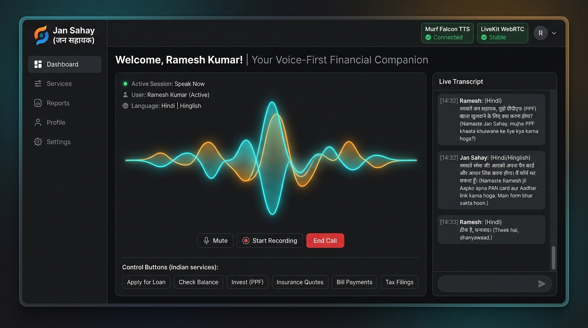
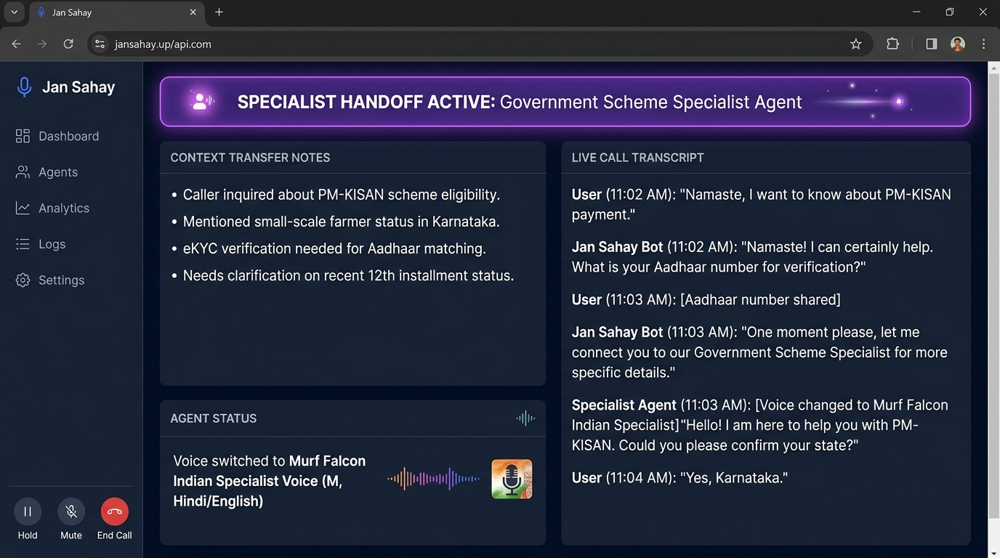
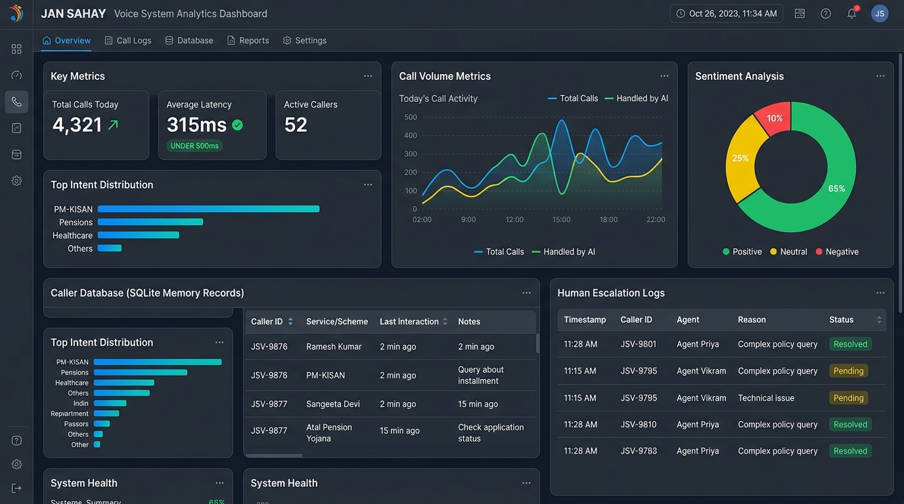

# Jan Sahay (जन सहायक) — Visual Interface & System Screenshots

This folder contains high-resolution screenshots and visual documentation representing the operational Jan Sahay multilingual voice AI platform.

---

## 1. Project Concept & Vision Banner

---

## 2. Main Voice Assistant Interface

- **Features**: Live audio wave visualizer (cyan/amber), multi-lingual transcript drawer (Hindi, Hinglish, English), participant session state, real-time connection status badges for **Murf Falcon TTS** and **LiveKit WebRTC**, and Indian financial service quick-action buttons.

---

## 3. Multi-Agent Specialist Handoff

- **Features**: Glowing active specialist banner alert (`[SPECIALIST HANDOFF ACTIVE: Government Scheme Specialist Agent]`), context transfer notes for scheme eligibility (e.g. PM-KISAN, APY), live transcript drawer, and dynamic voice switching indicator to Murf Falcon Indian Specialist Voice.

---

## 4. Call Analytics & Memory Dashboard

- **Features**: Total call volume metrics, sentiment analysis charts (Positive/Neutral/Negative), SQLite caller memory records (`caller_data.db`), human escalation audit log, intent distribution, and sub-500ms average response latency indicator.
