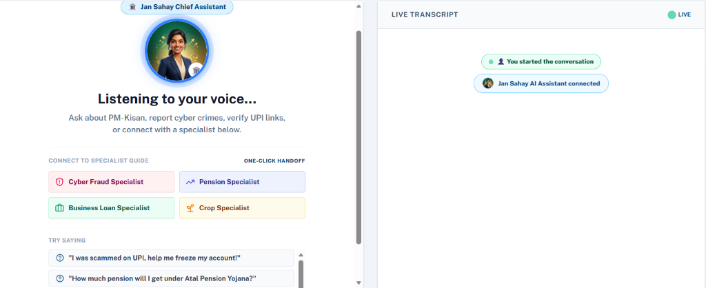
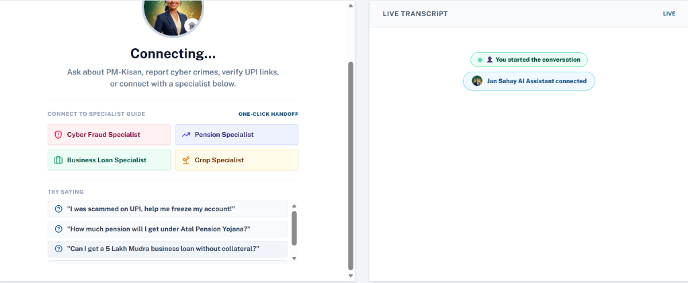
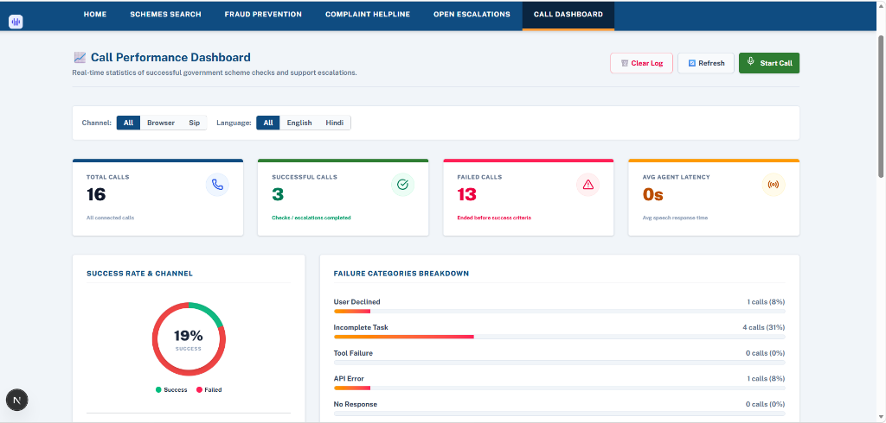
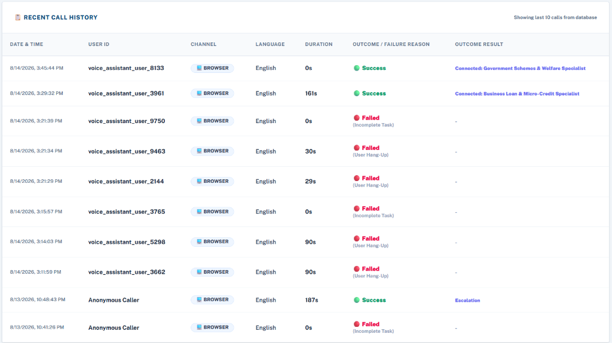

# Jan Sahay (जन सहायक) — Visual Interface Screenshots & Application Models

This folder contains the official screenshots and visual interface models captured from the running Jan Sahay platform.

---

## 1. Project Vision Banner

---

## 2. Voice Agent Interface — Active Listening Mode

- **Features**: Active spoken interaction view showing "Listening to your voice...", Jan Sahay Chief Assistant avatar badge, real-time Live Transcript drawer, and One-Click Handoff controls (Cyber Fraud Specialist, Pension Specialist, Business Loan Specialist, Crop Specialist).

---

## 3. Voice Agent Interface — Connecting & One-Click Handoff Guide

- **Features**: Connection initialization view displaying avatar status, prompt suggestions ("I was scammed on UPI...", "How much pension under APY...", "5 Lakh Mudra loan without collateral"), and live participant track indicators.

---

## 4. Call Performance Dashboard

- **Features**: Operational metrics capturing Total Calls, Successful Calls, Failed Calls, Average Agent Latency, Success Rate Breakdown by Channel (Browser/SIP), and Failure Category Analytics (User Declined, Incomplete Task, Tool Failure, API Error).

---

## 5. Recent Call History Database View

- **Features**: Persistent SQLite call logs (`caller_data.db`) detailing Date & Time, User ID, Channel, Language, Duration, Outcome Status (Success/Failed), and Outcome Results (Specialist Connection / Escalation).
